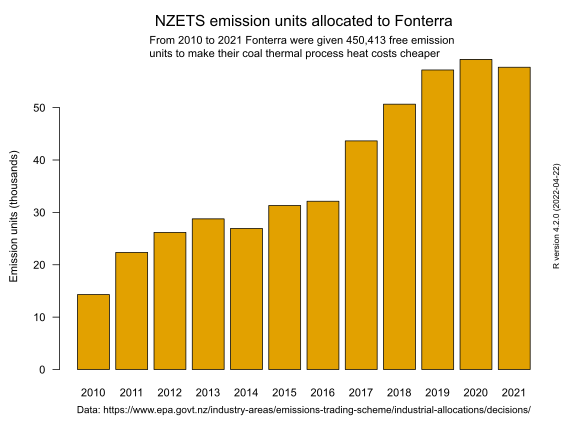
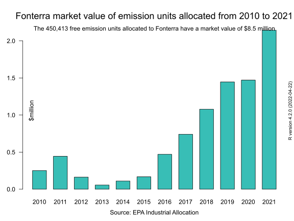

## Fonterra also wants to be paid for increasing emissions and paid for reducing emissions 

Fonterra has also got it's hand out to the Government to double dip government subsidies for both increasing and reducing emissions.

[Fonterra says $100m in carbon credit costs could help pay for clean energy](https://www.rnz.co.nz/news/business/490569/fonterra-says-100m-in-carbon-credit-costs-could-help-pay-for-clean-energy)

Fonterra chief operating officer Fraser Whineray told Morning Report today that it was working to reduce emissions, but more government assistance would help.

At the moment, for each tonne of greenhouse gases the company must pay into the government's Emissions Trading Scheme, but Whineray said he would like to see more of that be given back to Fonterra to help it introduce more clean alternative energy sources.

> "Our total off-farm emissions in New Zealand at the moment is about 1.5 - 1.6 million tonnes [per year], and so you times that by the carbon price, and that's roughly the cost of surrendering carbon for our emissions in New Zealand each year.

> "The ETS is supposed to recycle funds back into decarbonisation. And if we're spending more than $100m a year on carbon credits, getting a little bit of that back to help pay for the actual projects - some of which we've got under way and some much larger ones in front of us, that sounds like a pretty reasonable starting point."

But Fonterra has been paid and continues to be paid to increase their coal thermal emissions under the 'Industrial Allocation' rules of the crazy emissions trading scheme.

Here is a bar chart of free emission units given to Fonterra under the ['Industrial Allocation'](https://www.epa.govt.nz/industry-areas/emissions-trading-scheme/industrial-allocations/) rules. The total number of units given to Fonterra over the 12 years since 2010 is 450,413 emission units.

Allocation of units is proportional to production. That method is called ["output intensity"](https://en.wikipedia.org/wiki/New_Zealand_Emissions_Trading_Scheme#Allocation_of_NZ_Units_to_trade-exposed_activities) based.

If Fonterra increases its production it gets more units. The allocation of units incentivises increasing emissions.

How come Fonterra doesn't mention its already being given a government hand out for maintaining and increasing its emissions?

Here is a chart of the year by year value of the free emission units given to Fonterra.

The U-shaped dip in value in 2012 and 2013 reflects the collapse of carbon prices when the market was flooded by dodgy imported international 'hot air' emission units.

The sharp upward increase in value of the allocations is caused by the [2020 changes to the emissions trading scheme](https://www.epa.govt.nz/industry-areas/emissions-trading-scheme/changes-to-the-ets/). Out went paying for unit surrender liabilities with unlimited volumes of units at a fixed price of $25 per tonne. In came auctions of units four time a year.

If it's worth paying Fonterra to reduce it's emissions shouldn't we first stop paying them to increase their emissions?
